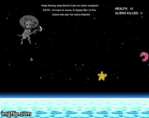

# Harley Saves Earth!
You play Harley, an astronaut-dog and help her defend Earth from an alien invasion!

## How to Play
* Install Python and Pygame if not already installed.
* Use the arrow keys to move, and the space key to shoot!

## Credit
* Character art for Harley, Alien, and Star created by [Jennifer Menze](https://github.com/jamenze)
* Background art credit | hdwallpaperim's [space pixel art](https://hdwallpaperim.com/space-pixel-art-horizon-stars/)
* Collision Sound effect credit | timgormly's [8-bit Bump.aif](https://freesound.org/people/timgormly/sounds/170141/)
* Laser Sound effect credit | 
* Music credit | joshuaempyre's [Arcade Music Loop.wav](https://freesound.org/people/joshuaempyre/sounds/251461/)

## Programming Languages used
* Python
* [Pygame](http://www.pygame.org/news)

## MVP (Minimum Viable Product)
* Player can use keyboard to move and shoot
* Display Player's health, subtract from health if hit by an alien
* Display amount of aliens killed

## Code Snippets
```
# Make alien chase Harley
for bad_guy in bad_guys:
  # update the bad guy (based on where the player is)
  bad_guy.update_me(the_player)
  # draw the bad guy
  bad_guy.draw_me()

for bullet in bullets:
  # update the bullet location
  bullet.update()
  # draw the bullet on the screen
  bullet.draw_bullet()
    
# Alien collides with Harley
player_hit = groupcollide(players,bad_guys,False, True) # Bad guy sticks around after collision
if (player_hit):
  bump = pygame.mixer.Sound("Sounds/bump.aiff")
  bump.play(0) # Play sound once
  bump.set_volume(1) # Set sound volume
  player.health -= 2 # Harley loses 2 health points if hit
  print "Harley has %d health points!" % (player.health)
    
```
